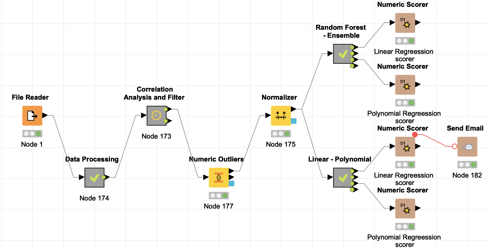
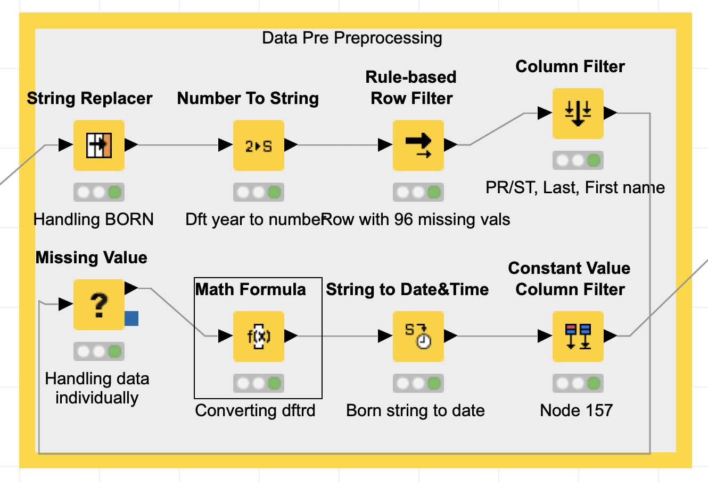
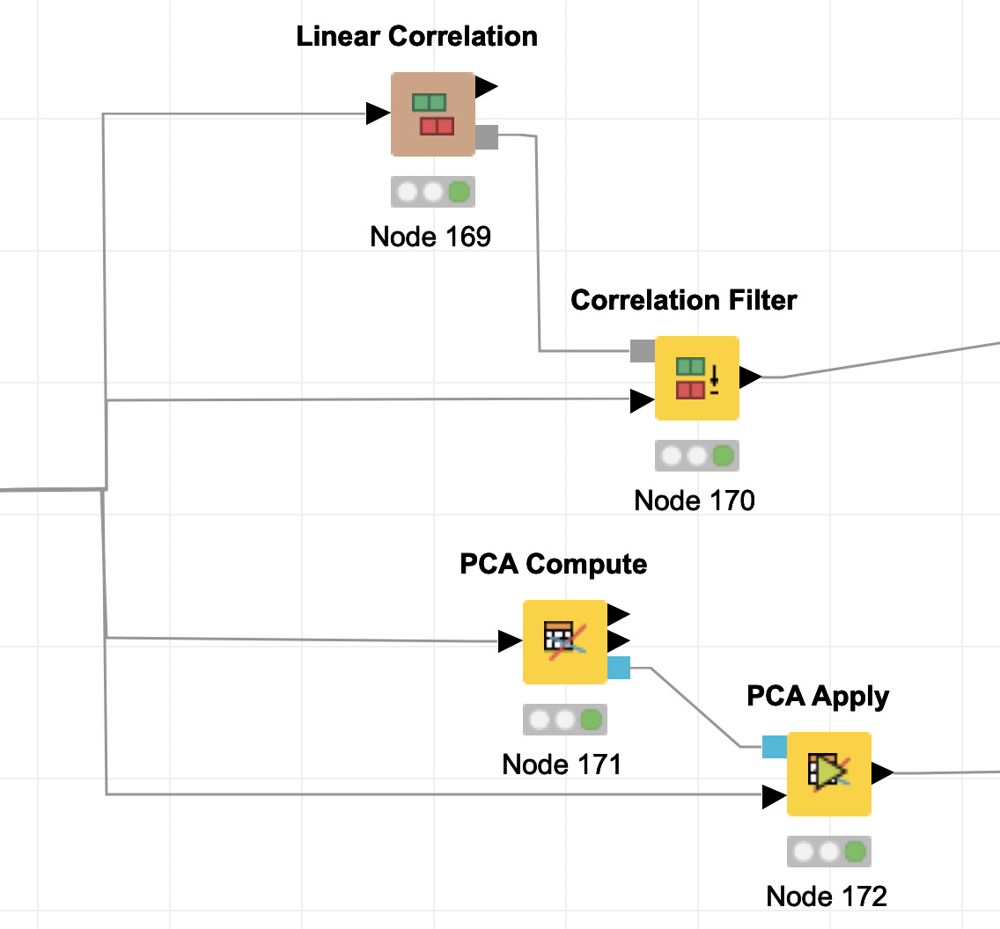
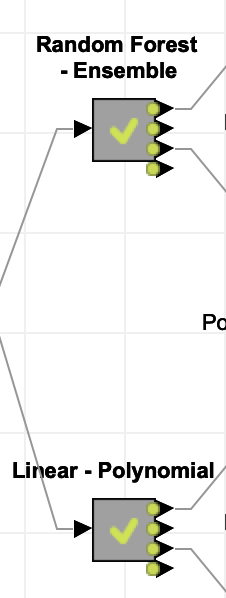
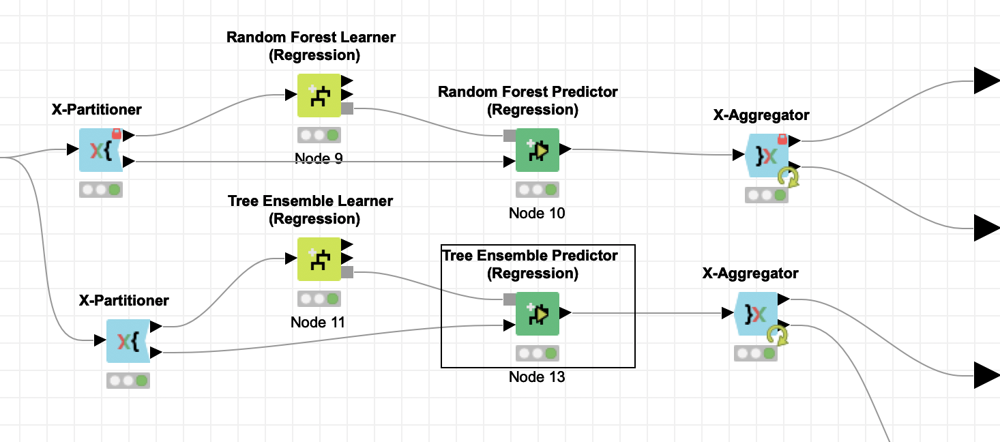
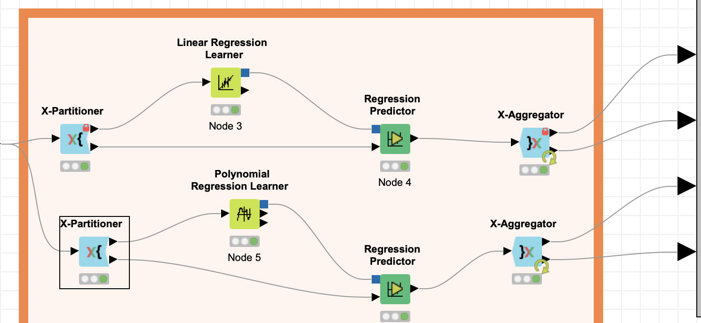

# KNIME Project
* Predictive analysis
* Real data

## Outline
CSV file consists of the player details with their salaries.
Knime tool is used to follow all the CRISP process

## CRISP
1. Project Understanding
2. Data Understanding
3. Data Pre-processing
4. Modeling
5. Evaluation
6. Deployment
We perform the steps 1 to 5 here.

Since this is a regression problem where we predict the numerical value which is the salary of a player, we use the numeric scorer node to identify the quality of the output.

### Process of using this file for learning
* Download workflow
* Download the data
* Install KNIME software from knime portal
* In the first node, (File Reader), browse and select the csv file and run the workflow
* Use the numeric scorer to find the results

# Work Flow

***

# Project Understanding

# Data Pre-Processing

# Modeling & Evaluation

***

***

***
